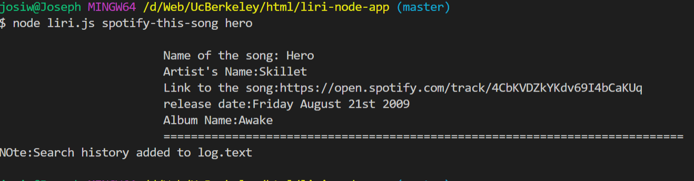
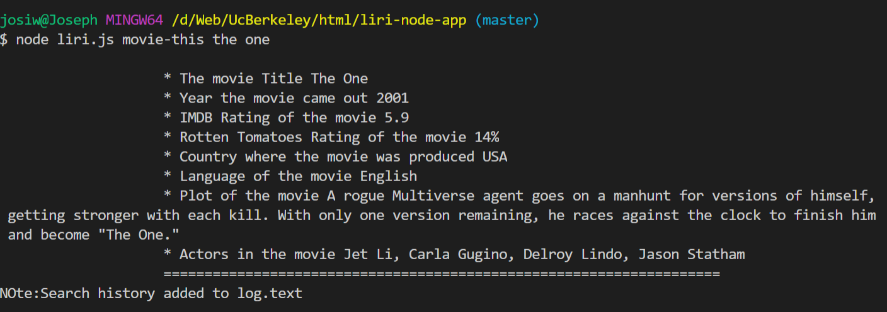
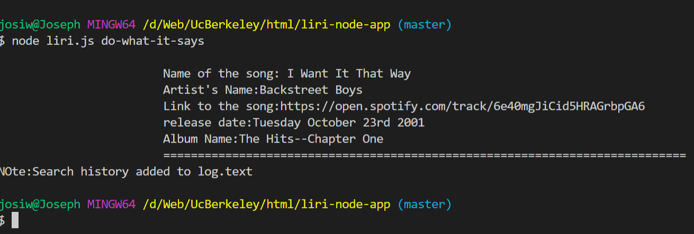

# liri-node-app
takes command line input language and search for bands in a town 

**When user input spotify-this-song liri will give this out put**

***************************************
**when user input movie-this**

*liri will out put detail info about the movie that the user entered*

***************************************
**When user input do-what-it-says**
*liri will out put to default song i want it that way 

